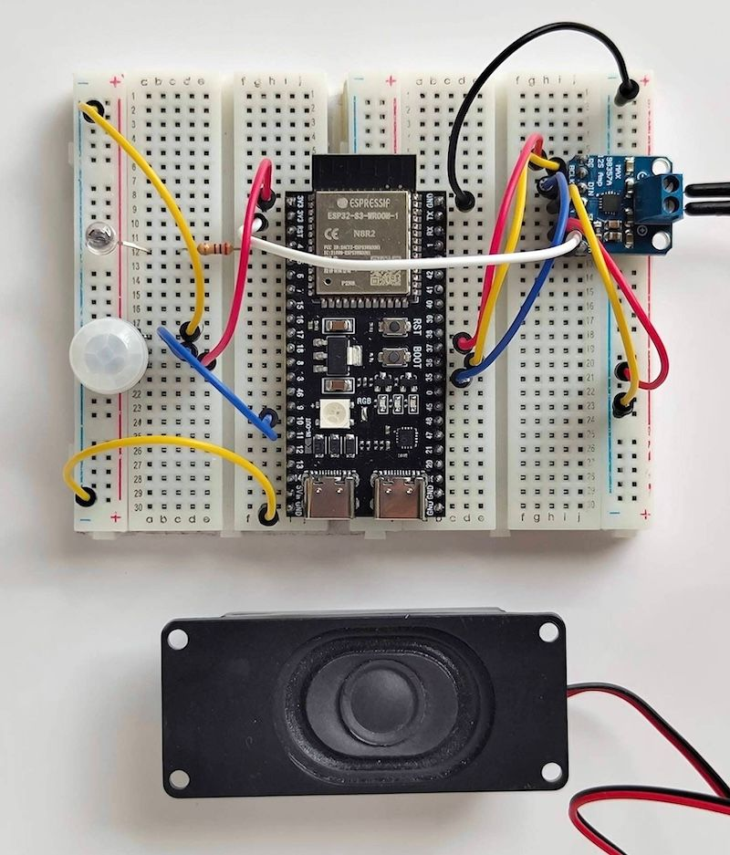

# motion detection audio scarer
There is a motion sensor. When it detects movement, it plays [this sound](https://www.youtube.com/watch?v=tCkGAfNHygw).  
The time spent on making this will undoubtedly give a high ROI, long-term.  

Bugs: There's a pop at the end of the audio; well documented with the MAX98357. The speaker is a little sensitive. Don't overdrive it like I did in testing.  
  
  
### Equipment  
- ESP32S3 DEVKIT C WROOM  
- ADA4871 mini PIR motion sensor  
- MAX98357 amplifier and speaker  
- an LED
  
  
### .pcm audio file
This is written for unsigned 8-bit mono PCM @ 44100. The easist way is to use FFMPEG.  
```zsh
./ffmpeg -i audioFile.wav -f u8 -ar 44100 -ac 1 o.pcm
```
  
  
